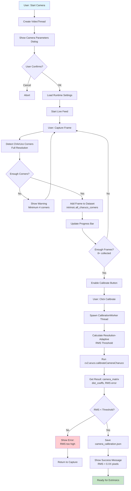
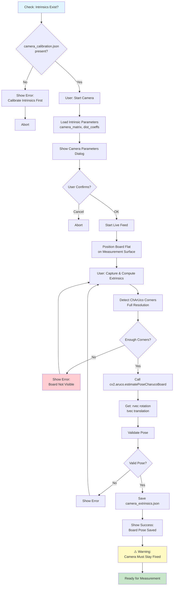
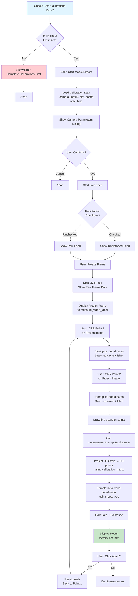
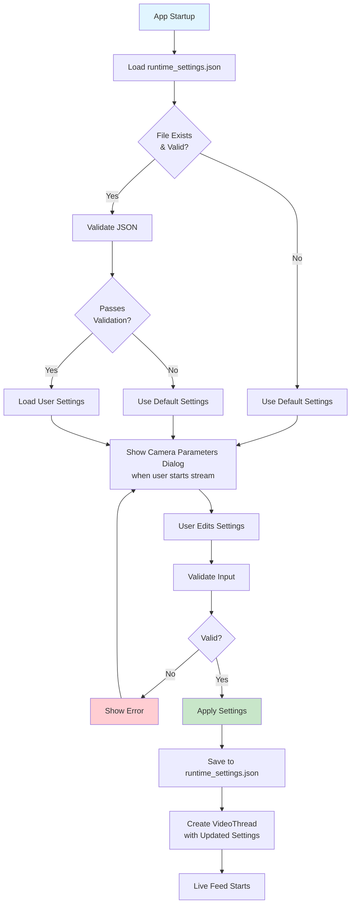
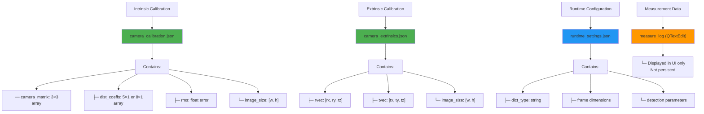
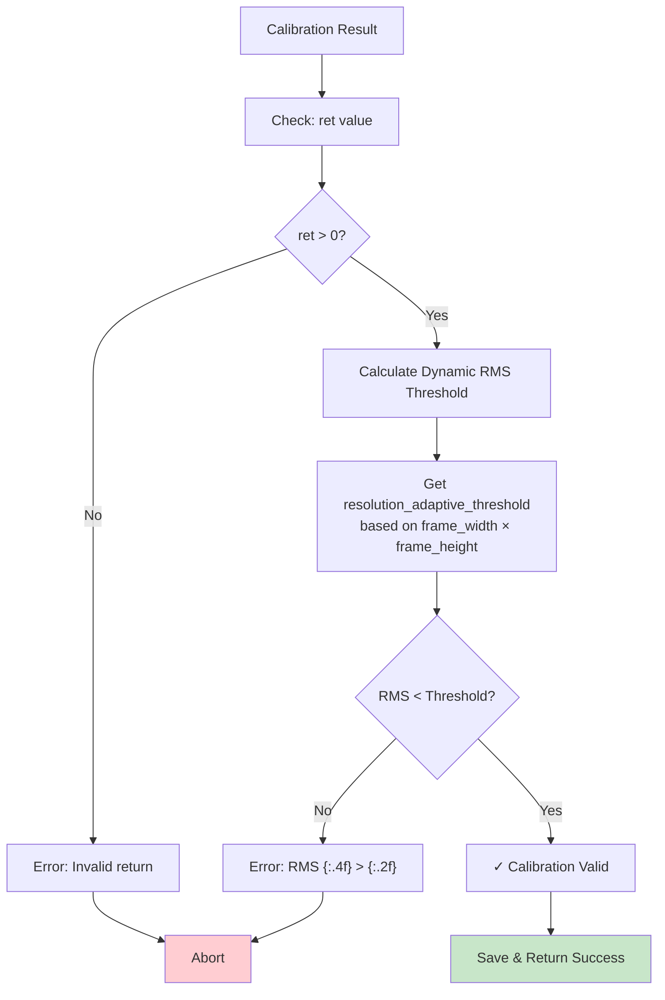
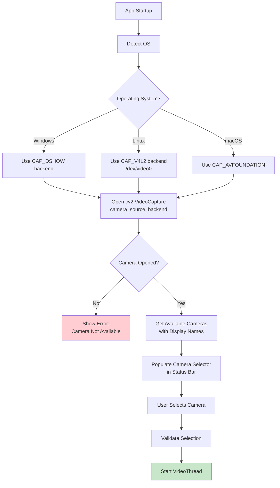
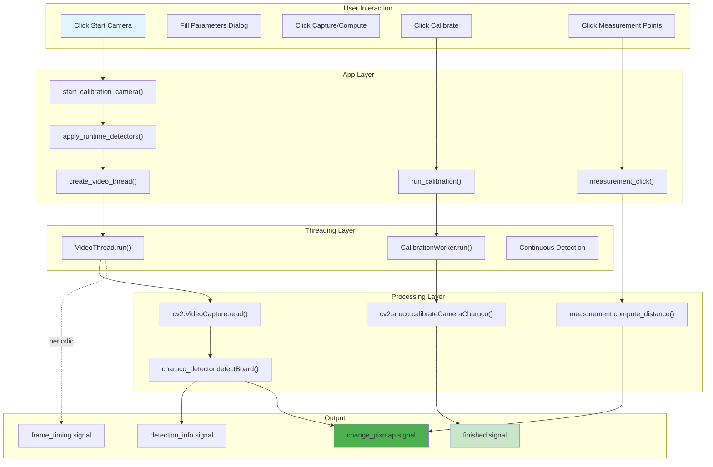
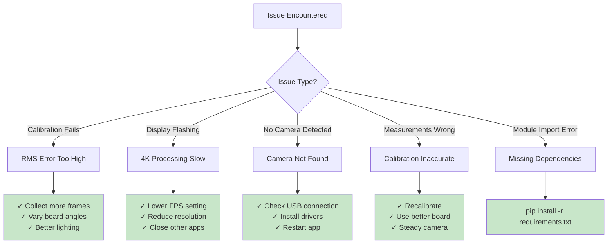

# ChArUco Calibration & Measurement Tool - Project Overview

## Executive Summary

This is a **professional-grade PyQt6 desktop application** for precise camera calibration and 3D measurement using ArUco/ChArUco markers. The tool provides a complete workflow from intrinsic lens calibration → board pose estimation → real-world measurements.

**Key Features:**
- 🎯 **Resolution-adaptive calibration** (works from 1280p to 4K+)
- 📏 **Sub-millimeter measurement accuracy**
- 🔧 **Modular architecture** (7 independent modules)
- 🖥️ **Cross-platform** (Windows, Linux, macOS)
- ⚡ **High-performance** (30fps live detection, frame-skipping optimization)

---

## Project Architecture

### Module Dependency Map

```
┌─────────────────────────────────────────────────────────────────┐
│                     Calibration_App.py (GUI)                    │
│                      (PyQt6 Interface)                          │
└──────────────────────┬──────────────────────────────────────────┘
                       │
        ┌──────────────┼──────────────┐
        │              │              │
        ▼              ▼              ▼
    ┌────────┐   ┌──────────┐   ┌──────────┐
    │ config │   │ video    │   │ intrinsic│
    │        │   │ _thread  │   │_calib    │
    └────────┘   └──────────┘   └──────────┘
        │              │              │
        ├──────────────┼──────────────┤
        │              │              │
        ▼              ▼              ▼
    ┌─────────────────────────────────────┐
    │    camera_utils (OS detection)      │
    │  (Windows/Linux/macOS handling)     │
    └─────────────────────────────────────┘
        │
        ├─────────────┬─────────────┐
        │             │             │
        ▼             ▼             ▼
    ┌──────────┐ ┌──────────┐ ┌──────────┐
    │extrinsic │ │measurement│ │ cv2/aruco│
    │_calib    │ │(3D math) │ │ detection│
    └──────────┘ └──────────┘ └──────────┘
```

### File Organization

```
ChArUco-Calibration/
├── Calibration_App.py              # Main GUI application (1100+ lines)
├── config.py                        # Configuration & detector init
├── camera_utils.py                  # OS-aware camera handling
├── video_thread.py                  # QThread for live capture
├── intrinsic_calibration.py         # Camera matrix computation
├── extrinsic_calibration.py         # Board pose estimation
├── measurements.py                  # 3D distance calculations
│
├── camera_calibration.json          # Saved intrinsics
├── camera_extrinsics.json           # Saved board pose
├── runtime_settings.json            # User preferences
│
├── README.md                        # Setup & usage guide
├── OVERVIEW.md                      # This file
└── ChArUco Board/                   # Printable board files
```

---

## Core Workflows

### 1️⃣ Intrinsic Calibration Workflow

**Goal:** Compute camera matrix (focal length, principal point, distortion coefficients)



**Key Components:**

| Component | Purpose | Input | Output |
|-----------|---------|-------|--------|
| **CalibrationWorker** | Background thread | Frame corners, board, resolution | RMS error, camera matrix |
| **get_resolution_adaptive_rms_threshold()** | Dynamic threshold scaling | frame_width, frame_height | RMS threshold (pixels) |
| **cv2.aruco.calibrateCameraCharuco()** | OpenCV calibration | Corners, IDs, board, image size | Camera parameters |
| **IntrinsicCalibration** | Data management | Frames, corners, IDs | Stored calibration data |

**RMS Threshold Scaling:**
```
Resolution       Threshold    Why?
─────────────────────────────────────
1280×960         1.5 px      Reference (baseline)
1920×1440        2.25 px     1.5x higher resolution
3840×2160 (4K)   4.13 px     2.75x higher resolution

Formula: threshold = 1.5 × (diagonal / reference_diagonal)
```

---

### 2️⃣ Extrinsic Calibration Workflow

**Goal:** Estimate board pose (rotation + translation) relative to camera



**Data Flow:**

```
Input:
├── camera_matrix (from intrinsic calibration)
├── dist_coeffs (from intrinsic calibration)
├── ChArUco board corners (detected in live frame)
└── ChArUco board corners (IDs from board definition)

Processing:
├── Undistort detected corners using dist_coeffs
├── Solve PnP problem (3D board → 2D image)
└── Estimate rotation vector (rvec) & translation vector (tvec)

Output:
└── camera_extrinsics.json
    ├── rvec: [rx, ry, rz] rotation
    ├── tvec: [tx, ty, tz] translation in meters
    └── image_size: [width, height] for reference
```

---

### 3️⃣ Measurement Workflow

**Goal:** Measure real-world distances using calibrated camera and board pose



**Measurement Math:**

```
Step 1: 2D Image Coordinates → 3D Camera Coordinates
────────────────────────────────────────────────────
Given:
  - Pixel coordinates: [u, v] (from clicks)
  - Distortion coefficients: dist_coeffs
  - Camera matrix: K = [[fx, 0, cx], [0, fy, cy], [0, 0, 1]]

Normalize: 
  - [x_norm, y_norm] = undistort([u, v]) using dist_coeffs
  - [x_norm, y_norm, 1] = K^(-1) × [u, v, 1]

Step 2: Project onto Board Plane
────────────────────────────────
Using board pose (rvec, tvec):
  - Transform: [x_world, y_world, z_world] = R × [x_norm, y_norm, z] + T
  - Find intersection with board plane (z_board = 0)

Step 3: Calculate Distance
──────────────────────────
distance = ||point1_world - point2_world||
```

---

## Video Processing Pipeline

### Real-time Capture & Detection

```mermaid
graph LR
    A["Camera Capture<br/>30 FPS"] --> B["Apply Frame Size<br/>1280×960 to 4K"]
    B --> C["Convert BGR → Gray"]
    C --> D{Invert<br/>Colors?}
    D -->|Yes| E["Bitwise NOT<br/>Dark on light"]
    D -->|No| F["Use As-Is"]
    E --> G["Detect ChArUco"]
    F --> G
    G --> H["Extract Corners & IDs"]
    H --> I["Emit detection_info<br/>Full Resolution"]
    I --> J{Rendering<br/>Busy?}
    J -->|Yes| K["Skip Frame<br/>Backpressure"]
    J -->|No| L["Draw Detections<br/>on Frame"]
    L --> M["Convert RGB"]
    M --> N["Create QImage<br/>for Display"]
    N --> O["Emit change_pixmap<br/>to UI"]
    O --> P["Update Video Label<br/>on Screen"]
    K --> Q["Track Timing<br/>Avg Frame Time"]
    P --> Q
    Q --> R{Every 1s:<br/>Avg > 40ms?}
    R -->|Yes| S["Emit frame_timing<br/>Warning Signal"]
    R -->|No| T["Continue"]
    S --> U["Show Status Bar<br/>⚠ High Processing"]
    T --> U
    
    style A fill:#ffeb3b
    style I fill:#4caf50
    style K fill:#ff9800
    style S fill:#f44336
```



### Frame-Skipping Backpressure (4K Optimization)

```
Timeline: Processing at 4K (3840×2160)
──────────────────────────────────────

Frame 1:  [Cap] [Proc: 45ms] [Emit] [Render: 20ms]  
Frame 2:  [Cap] [Proc: 45ms] [Skip] ← rendering still busy
Frame 3:  [Cap] [Proc: 45ms] [Emit] [Render: 20ms]
Frame 4:  [Cap] [Proc: 45ms] [Skip] ← rendering still busy
...

Result:
├─ No frame queuing (prevents flashing)
├─ Display smoother (1 frame in flight)
├─ Detection at full 4K (calibration accuracy preserved)
└─ Frame rate lower but smooth (adaptive to hardware)
```

---

## Configuration Management

### Runtime Settings Flow



**Settings Schema:**

```json
{
  "dict_type": "DICT_4X4_50",
  "squares_x": 6,
  "squares_y": 5,
  "square_length": 0.010,
  "marker_length": 0.008,
  "invert_colors": true,
  "frame_width": 1280,
  "frame_height": 960
}
```

---

## Data Persistence

### File Formats & Flow



---

## Error Handling & Validation

### Calibration Quality Checks



---

## OS-Aware Camera Handling



---

## Performance Characteristics

### Processing Times (Benchmarks)

```
Resolution      Per-Frame Time    Throughput    Recommendation
────────────────────────────────────────────────────────────────
1280×960        ~20ms             30 FPS ✓      Excellent
1920×1440       ~30ms             ~28 FPS ✓     Good
2560×1440       ~35ms             ~25 FPS ✓     Acceptable
3840×2160 (4K)  ~50ms             ~15 FPS ⚠     May need throttling

* On modern multi-core CPU (Intel i7/i9 or AMD Ryzen 5+)
* Times include: capture, decode, detection, Qt conversion
* Frame-skipping activated at 4K to prevent flashing
```

### Memory Usage

```
Resolution      Frame Data    QImage Buffer    Total/Frame
──────────────────────────────────────────────────────────
1280×960        3.7 MB        11 MB            ~15 MB
1920×1440       8.2 MB        25 MB            ~33 MB
3840×2160       24 MB         72 MB            ~96 MB

* Includes raw frame, RGB conversion, Qt texture
* System should have 4GB+ RAM for smooth 4K
* Multiple frames buffered for detection history
```

---

## Signal Flow Diagram

### Complete Event Sequence



---

## Troubleshooting Flow

### Common Issues & Resolution



---

## Summary Table: Component Responsibilities

| Component | Input | Processing | Output | Error Handling |
|-----------|-------|-----------|--------|---|
| **VideoThread** | Camera frames | Capture, detect ChArUco, convert to Qt | QImage, detection_info | Camera disconnect detection |
| **CalibrationWorker** | Corners, IDs, board | OpenCV calibration, RMS check | Camera matrix, coeffs | RMS threshold validation |
| **Measurement** | 2D pixels, calibration | 3D projection, distance calc | Distance (m, cm, mm) | Invalid point validation |
| **config** | None | Validation, detector creation | Validated settings, detectors | Type/range checking |
| **camera_utils** | OS type | Backend selection, enumerate | Camera sources, properties | Device availability check |

---

## Version History

| Version | Date | Major Changes |
|---------|------|---|
| 3.0 | 2025-03 | Modular architecture refactor |
| 2.1.0 | 2026-05 | Resolution-adaptive RMS + frame-skipping |
| 2.0 | 2025-01 | PyQt6 GUI, ChArUco support |
| 1.0 | 2024-12 | Initial release |

---

## Next Development Roadmap

- [ ] GPU acceleration (CUDA/OpenCL) for 4K processing
- [ ] Batch calibration (multiple images at once)
- [ ] Real-time measurement video overlay
- [ ] Export measurements to CSV/Excel
- [ ] Multi-camera support
- [ ] Calibration profile management
- [ ] Automated board detection and generation

---

**Project Lead:** Camera Calibration Team  
**Last Updated:** May 2026  
**License:** MIT (assumed)
